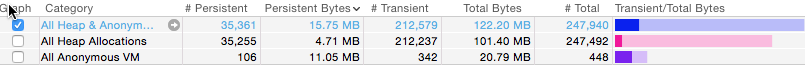
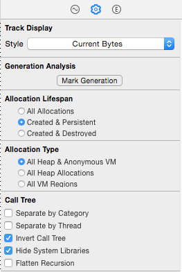
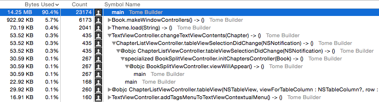
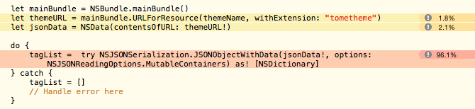

Столбец Persistent Bytes категории All Heap Allocations показывает как много
памяти сейчас используется. На скриншоте ниже приложением используется 4.71 MB.



Инструмент Allocations не пишет OpenGL/ES texture memory.
Если приложение аллоцирует память под текстуры, то фактическое потребление
памяти будет выше, чем показывают Instuments.

Описание столбцов для каждой категории памяти:

- \# Persistent - количество аллокаций памяти, еще не освобожденных.

- Persistent Bytes - сумма аллоцированной памяти, еще не освобожденной.

- \# Transient - общее количество аллокаций памяти (освобожденных).

- Total Bytes - общая сумма аллоцированной памяти (включаяя освобожденную память).

- \# Total - общее количество аллокаций памяти (включая освобожденную память).
  Должно быть равно сумме столбцов # Persistent и # Transient.

Пример:

Приложение делает 20 аллокаций памяти по 1000 байт и потом осовобождает память
для 15 из них:

```
# Persistent: 5
Persistent Bytes: 5,000
# Transient: 15
Total Bytes: 20,000
# Total: 20
```

# Call Trees

Если приложение аллоцирует много памяти, то первое что нужно сделать это узнать
какой код аллоцирует много памяти. Чтобы найти этот код нужно переключиться на
вид call tree. Для этого нужно нажать на Statistics и выбрать Call Trees.
Чтобы легче найти этот код нужно сконфигурировать Instruments.

Нужно выбрать Invert Call Tree чтобы вытащить функции аллокации памяти наверх.
Также нужно выбрать Hide System Libraries чтобы спрятать Apple-код.



Для пользовательского кода отображается соответствующая иконка:



Если кликнуть по кнопке раскрытия дерева с зажатой клавишей Option то откроется
или закроется все поддерево.

Для каждой функции в call tree показывается использованное количество байт и
количество аллокаций. Байты показаны как количеством так и процентом от общего
количества аллоцированной памяти.

На скриншоте выше строка

```
922.92 KB   5.7%    6173
```

говорит о том, что эта функция и ее поддерево аллоцировали 922.92 KB памяти,
что составляет 5.7% от общего количества аллоцированной памяти. Эта функция и
все другие функции в поддереве сделали 6173 аллокация памяти.

Inverting the call tree reduces the subtree, which makes the listing for a
function in an inverted call tree the closest approximation to the amount of
memory that function is allocating.

If you set an inspection range in the graph, the listing reflects the amount of
memory allocated in the inspection range’s time interval.

For most Mac and iOS applications, the first listing in the call tree view is
the main function. This function is going to have a high amount of bytes used
and allocations. If you don’t invert the call tree, the main function will show
100% bytes used. That’s because main is the starting point of your application.
Every function in your application will have main in its call stack so every
memory allocation your application makes will have main in its call stack.

Двойной щелчок на функции в call tree показывает исходники.


