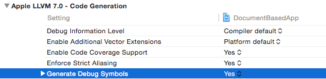

Перед тем как проифилировать приложение с помощью Instruments нужно включить
билд-опцию Generate Debug Symbols:

Если проект не генерирует debug-символы, то в Instruments будут показываться
адреса памяти вместо имен функций.
